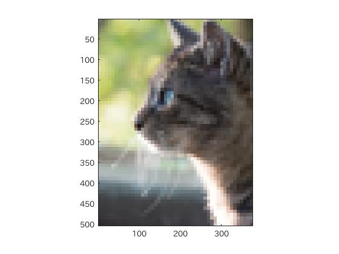
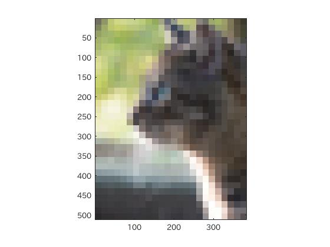
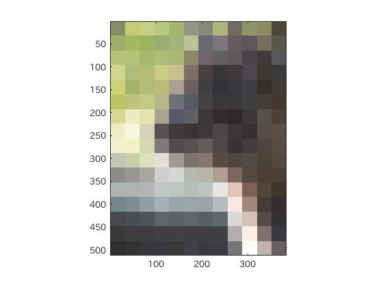
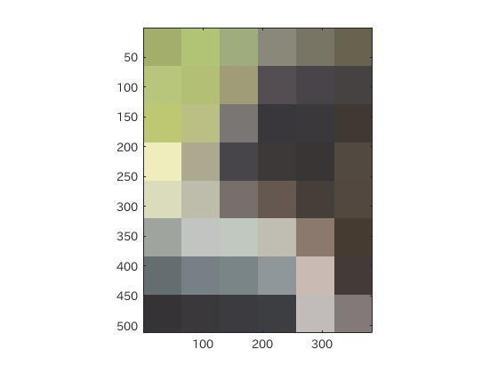
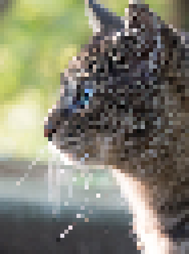

#課題1 レポート
####1. はじめに  
ここでは、MATLABを用いて標本化間隔による解像度の違いを確認する。
  
####2. 画像のダウンサンプリング  
標本化間隔によって空間解像度が異なることを擬似的に体験する。  
まず画像を読み込み表示する。読み込むためには、imread関数を、表示するにはimage(sc)関数を用いる。

    01 IMG = imread();%画像をIMG変数に格納
    02 image(IMG);%IMGを表示

今回は以下のような著作権フリー画像を用いて検討する。  

図1. 使用画像

画像をサンプリングする際にサンプリング間隔が小さいと、以下の画像のようなエイリアスが生じる。

図2. サンプリング間隔の小さい画像

逆にサンプリング間隔が大きいと、画像の解像度が大きくなり、鮮明に再現される。  
これをMATLABで再現する。  
MATLABでは、画像を縮小した後に画像を拡大することで擬似的に解像度を変更して、サンプリング間隔を変更する。

MATLABにおける画像の拡大縮小は、imresize関数を用いて行う。
この関数の使い方は、引数に変更前の画像と拡大縮小比率を渡すことが基本である。

    A = imread();
    B = imresize(A,scale);

このようにする。

まず、1/2倍に縮小し2倍に拡大する。
	
	A = imresize(IMG,0.5);%1/2倍
	B = imresize(A,2,'box');
	image(B);

この時、拡大時にboxと指定しているのは箱型の内挿法を指定するためであり、これを外すと、解像度が落ちた時の標本化の間隔がぼやけたように表現されるために解像度の違いを具体的に確認することができない。

1/2倍の処理を行った時の画像が

  
図3.1/2倍サンプリング画像

である。1/2倍サンプリングではまだ画像が何であるか判別できる。

次に、1/2倍縮小した画像を更に1/2倍(すなわち1/4倍)し4倍に拡大する。
	
	A = imresize(A,0.5);
	B = imresize(A,4,'box');
	image(B);
	
1/4倍処理を行った画像が

  
図4. 1/4倍サンプリング画像

である。まだ何の画像か判断できるが、画像がぼやけたようになる。

以下に1/8倍処理、1/16倍処理、1/32倍処理、1/64倍処理を行った場合の画像を記す。

  
図5. 1/8倍サンプリング画像  
  
図6. 1/16倍サンプリング画像  
  
図7. 1/32倍サンプリング画像  
  
図8. 1/64倍サンプリング画像  

このように、解像度が荒くなると、標本点の間隔が大きくなるために画像が荒くなる(ぼやけたように見える)と言える。

このことを画像エディタGIMPでも確認する。  
  
図9.GIMPによる1/8倍サンプリング画像  

このようにサンプリング間隔の違いによっては画像の標本点の粗さが画像に現れる。

####3. ソースコード
[ソースコード](/Program/Program1.m)

####4.考察
画像のサンプリング周波数がサンプリング定理を満たさない値での再サンプリング(画像の縮小)を行い、その画像を単純拡大すると、荒削りのドット画像のようにモザイク状になることが確認された。  
これは、元の画像の解像度(標本化間隔)に対して縮小拡大をすることで解像度が変更される。解像度が変わるということは標本点の間隔が変わるということであるために画像が荒くなる。  
ある程度解像度を落としてしまうと元の画像がなんであったのか判別ができなくなっている。そのため、サンプリング定理を満たす程度のサンプリング間隔であることが望ましい。
