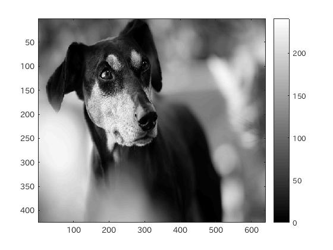
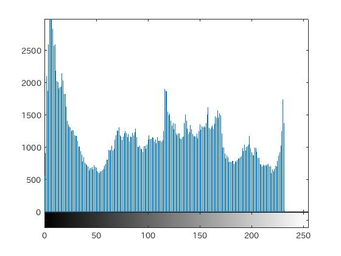
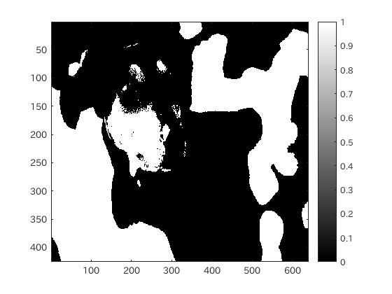
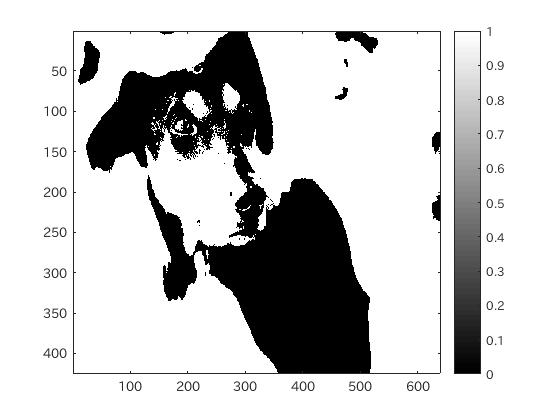
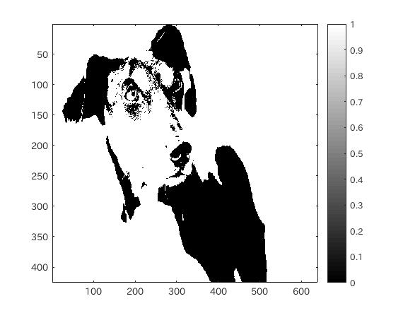
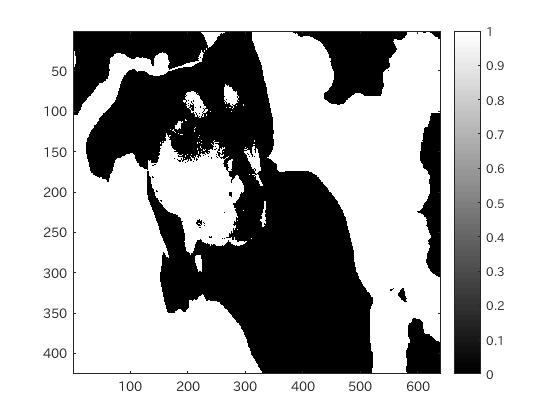

#課題3 レポート
####1.はじめに
ここでは、閾値を4パターン設定した状態の画像を表示し確認する。

####2.閾値の設定と表示
閾値は、2値処理を行う際の濃度値の境目となる画素のことで、ある値以上は1(白)のようにして処理をする。

MATLABでは、32、64、128、100の4つの閾値を用いて、画像を処理することを考える。
MATLABにおける閾値の処理の仕方は、閾値を超える値が真(1)であることを用いて、閾値よりも大きい濃度値を持つ画素は1(白)、そうでない画素は0(黒)として処理をする。

```matlab
	IMG128 = IMG > 128
```

このようにすることで、128よりも濃度値が大きい画素は白に変換される。
他の閾値の場合も同様である。

####3.ソースコード
[ソースコード](../Program/Program3.m)

####4.実行結果
  
図1.使用画像  
  
図2.図1の濃度ヒストグラム  
  
図3.閾値128の場合の画像  
  
図4.閾値64の場合の画像  
  
図5.閾値32の場合の画像  
  
図6.閾値100の場合の画像  

####5.考察
今回は、閾値について確認を行った。閾値は、2値濃度の境目のことで、これよりも上回った濃度を持つ画素は白、下回った濃度を持つ画素は黒と言ったように2値に変換することができる。  
0~255において、閾値の値を大きくすると、黒の割合が多い画像になり、小さくすると白の割合が多い画像になることがわかる。