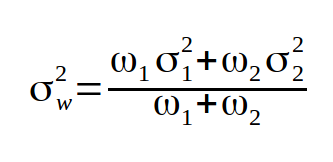
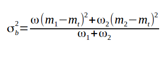
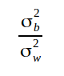
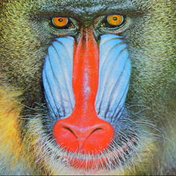
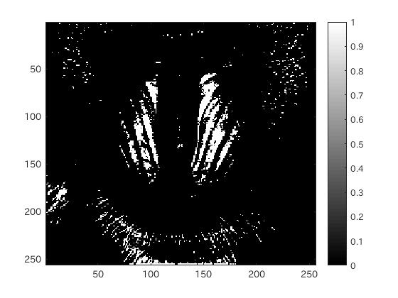

#課題5 レポート
####1.はじめに
ここでは、判別分析法について、MATLABを用いて実際に処理を行ってみる。

####2.判別分析法
判別分析法は、クラス内分散とクラス間分散という2つの分散を使って画像の最適な閾値を求める手法である。

MATLABでの処理としては、

	1.画像を読み込みグレースケール処理を施した後に、ヒストグラムを変数に格納する。
	2.画像を2つのクラスにわける(この境目が閾値になる。)
	3.わけた2つのクラスを用いてクラス間分散とクラス内分散を求める。
	4.(クラス間分散)/(クラス内分散)が最大となる場合のクラス間の境目を閾値とし、閾値処理を行う。

と言った手順で行う。

画像の画素数0~255を0-iとi-255までのクラスにわけ、最適なiを求める。

 
図1.クラス内分散式 
 
図2.クラス間分散式 

クラス内分散、クラス間分散はそれぞれ以上のような式で求めることができる。

これらの分散の比(分離度)  
 
図3.分離度  
を用いてこれが最大になるようなクラスのわけ方の境目が閾値となる。

####3.ソースコード
[ソースコード](../Program/Program5.m)

####4.実行結果
以下に実行結果を示す。 
 
図1.使用画像1 
 
図2.判別分析法による二値化(濃淡変化多)  
 
図3.使用画像2  
 
図4.判別分析法による二値化(濃淡変化少)

####5.考察
今回は、判別分析法を用いた閾値の導出、閾値処理を行った。  
判別分析法は、クラス間分散とクラス内分散の比である分離度を用いて、閾値を求める方法である。  
判別分析法は、計算式を用いてコンピュータなどで自動的かつ定量的に閾値を決定することができる。  

しかし、実行結果の画像からもわかるように、濃淡変化が小さいマンドリルの画像の場合では、殆どが黒くなってしまいうまく処理ができないという欠点がある。  

これを解消するために考えられたのが微分ヒストグラム法や、ラプラシアンヒストグラム法である。  
これらにも一長一短あるが、画像に応じて方法を選択することが重要である。