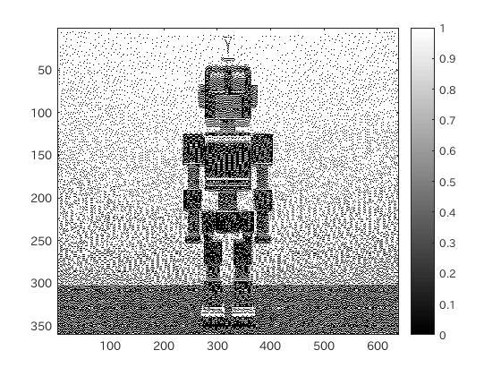
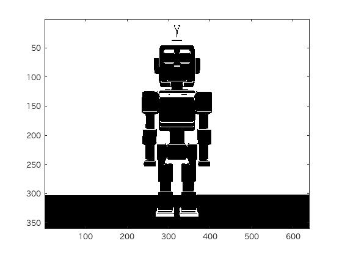

#課題6
####1.はじめに
ここでは、画像の2値化をいくつかの手法で行う。  
今回は、閾値による2値化、ディザー法による2値化、MATLAB関数による2値化を考える。

####2.2値化
######2-1.閾値による2値化
この手法は手動で閾値を決定したうえで2値化する方法である。  
今回は、閾値を128に設定する。

```matlab
	IMG = IMG > 128
```

このようにすることで、閾値を超えた濃度値を白色にすることができる。  
128は閾値であるため、黒色が多いほうがいい場合は、閾値を小さくすることで、実現できる。

######2-2.ディザー法による2値化
ディザー法は、ハーフトーン処理(点の集まりで密度が大きいところは濃く見え、密度が小さいところでは薄く見えるという目の錯覚を利用して、グレースケールを表現する方法)の一つである。

MATLABでのディザー処理は、

```matlab
	Dither = dither(IMG);
```
とすることで実現可能である。

######2-3.MATLAB関数による2値化
MATLABには、2値化処理を自動で処理してくれる関数がある。

```matlab
	BW = imbinarize(IMG);
```

imbinarize関数は、判別分析法を用いた閾値を計算し、2値化を処理する関数である。

また、この関数は、ただ2値化するだけでなく、対象画素が背景画素より暗い場合などに2値化をすることができると言った機能を持っている。

####3.ソースコード
[ソースコード](../Program/Program6.m)

####4.実行結果
以下に実行結果を示す。<br>
<br>
図1.使用画像<br>
<br>
図2.閾値を用いた二値化処理　<br>
<br>
図3.ディザー法を用いた二値化処理 <br>
<br>
図4.MATLAB関数を用いた二値化処理 <br>

####5.考察
各種2値化の手法をMATLAB上で実際に試した。

実行結果からも言えるように2値化の手法は様々である。  
特に、ディザー法は特殊な二値化処理の方法で、小さい点の集合で点の間隔が広いところでは、白に近く、間隔が狭いところでは、黒に近く表現されている。

ディザー法は、2値でしか表示できない表示装置でグレースケールを表現するために開発された方法である。
