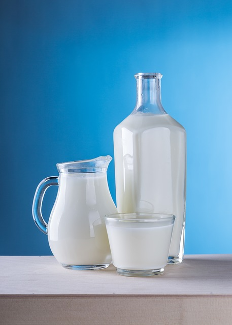
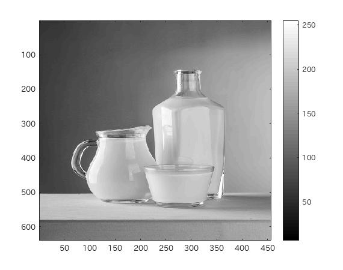
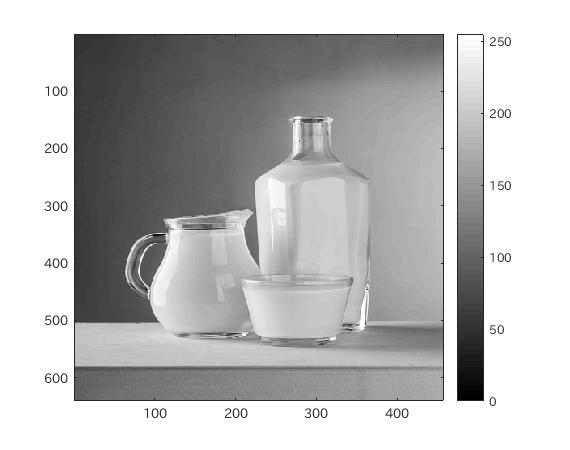
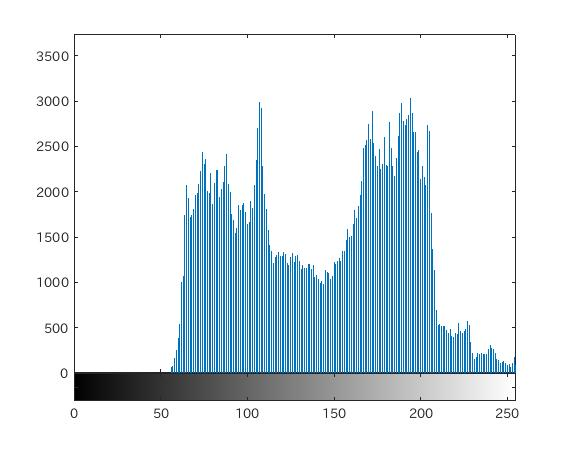
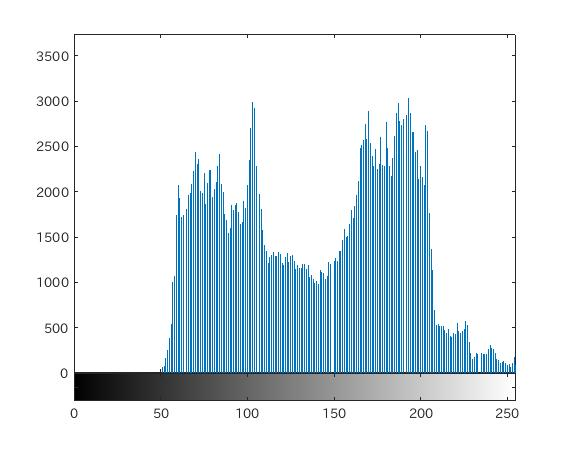

#課題7 レポート
####1.はじめに
ここでは、画像のダイナミックレンジを拡大する処理を確認する。

####2.ダイナミックレンジ
ダイナミックレンジは、画像の最大画素と最小画素の比率のことであり、ダイナミックレンジが小さい画像は、コントラストの低い画像となる。

これを改善するためにダイナミックレンジの拡大を行う。

MATLABでダイナミックレンジを拡大するには、まず画像を倍精度画像に変換する。  
次にその画像の画素値の最大値と最小値を導出する。  
導出した値を用いて、
	(画素-最小値)/(最大値-最小値)*255
という計算を行う。

これでダイナミックレンジ(比率)が拡大できたことになる。

次に、この拡大画像のヒストグラムを表示する。  
ヒストグラムはdouble型画像でも表示でき、拡大画像はdouble型で構成されているが、0~255の整数でダイナミックレンジを表現するためには、8ビットの符号なし整数に変換する必要がある。

変換するには、uint8型を用いてキャストする。

####3.ソースコード
[ソースコード](../Program/Program7.m)

####4.実行結果
 
図1.使用画像  
 
図2.グレースケール画像  
 
図3.ダイナミックレンジ拡大画像  
 
図4.グレースケール画像ヒストグラム  
 
図5.ダイナミックレンジ拡大後のヒストグラム

####5.考察
今回は、ダイナミックレンジ(濃度の最大値と最小値)を拡大した。  

実験結果からもわかるように、濃度ヒストグラムが少し左側にずれていることがわかる。

ダイナミックレンジを変更することで得られる利点として、ダイナミックレンジが狭い画像の場合、コントラストが低い画像になる問題が生じるが、これを解消することができる。
