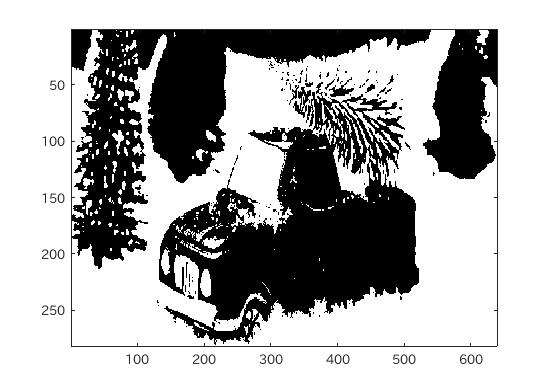
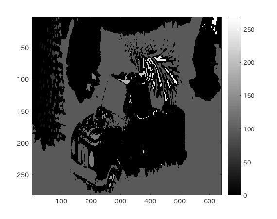

#課題8 レポート
####1.はじめに
ここでは、画像のラベリングを確認する。

####2.ラベリング
ラベリングとは、二値化処理された画像において、連結成分ごとに数字を割り当てる処理のことである。

MATLABにおいては、ラベリング処理をする関数が搭載されている。

```matlab
	IMG = bwlabeln(IMG);
```

####3.ソースコード
[ソースコード](../Program/Program8.m)

####4.実行結果
<br>
図1.使用画像  
<br>
図2.閾値による2値化処理  
<br>
図3.ラベリング処理後の画像  

####5.考察
今回は、画像のラベリングを行った。
ラベリングは、連結成分が同じものに数値を割り当てるなどをするグループ化処理のことで、ラベリングをすることで、欠陥検出検査や、分類処理などに応用することができる。

実行結果からもわかるように、連結成分ごとに濃度が変わって表示されている。


