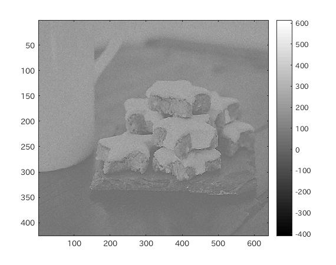
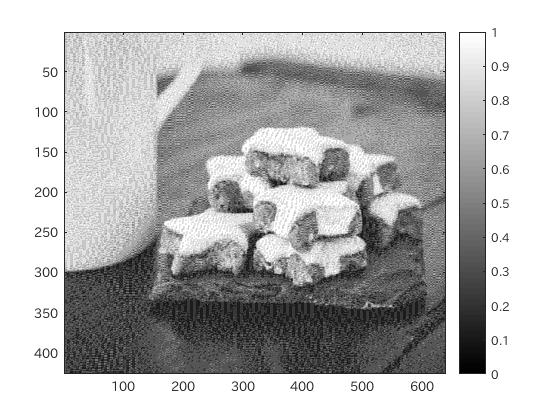

####1.はじめに
ここでは、メディアンフィルタによる画像のノイズ除去と鮮鋭化フィルタを用いた画像処理について確認する。

####2.メディアンフィルタによるノイズ除去
メディアンフィルタは、近傍画素の濃度値の中央値を変換後の濃度値とする方法で、今回は3画素の中央値で処理する。

メディアンフィルタを適用するには、まず画像にノイズ処理を施す。  
今回使用するノイズは、MATLAB標準関数のimnoise関数を用いて、poissonノイズとsalt&pepperノイズを適用し、これらのそれぞれに平滑化フィルタ処理をした後に、メディアンフィルタを適用する。

ノイズ処理は、

```matlab
	IMG = imnoise(IMG, 'ノイズの種類指定', パラメータ);
```
で適用できる。

また、平滑化フィルタ(averageフィルタ)は、3つの画素値を元に平滑化するので、

```matlab
	h = fspecial('average', 3);
```

として、平滑化フィルタを定義し、

```matlab
	Y = filter2(h, IMG);
```

で、定義したフィルタを画像に適用する。


次に、平滑化した画像に、メディアンフィルタを適用する。

```matlab
	Y = medfilt2(Y, [3 3]);
```
とすることで、メディアンフィルタを適用することができる。

####3.鮮鋭化
鮮鋭化は、画像の濃度変化を強調する手法であり、フィルタを用いて実現される。

まず、フィルタを定義する。  
今回は、

||||
|---|---|---|
|0|-1|0|
|-1|5|-1|
|0|-1|0|

というフィルタを使用する。  
この鮮鋭化フィルタをfilter2関数を用いて画像に適用する。

####4.ソースコード
[ソースコード](/Program/Program9.m)

####5.実行結果
<br>
図1.使用画像  
<br>
図2.poissonノイズ適用後の画像  
<br>
図3.平滑化処理後  
<br>
図4.メディアンフィルタ適用後  
<br>
図5.salt&pepperノイズ適用後の画像  
<br>
図6.平滑化処理後  
<br>
図7.メディアンフィルタ適用後  
<br>
図8.鮮鋭化フィルタ  
<br>
図9.ディザー法処理画像  
<br>
図10.平滑化処理  
<br>
図11.メディアンフィルタ適用  

####6.考察
実行結果を見ると、ポアソン分布ノイズを載せた場合はノイズを除去しきれていないが、salt&pepperノイズを載せた場合は、ほとんどノイズがなくなっている。

このように、ノイズによっては完全には除去できないので万能というわけではないが、それでも気にならない程度にはノイズが除去できているということが言える。

また、ディザー法処理を施した画像が、ひどいノイズが乗った画像のように見えたため、試しにノイズ処理を施したところ、他と同様にノイズが除去できることが確認できた。
