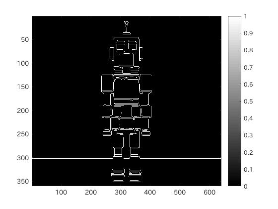
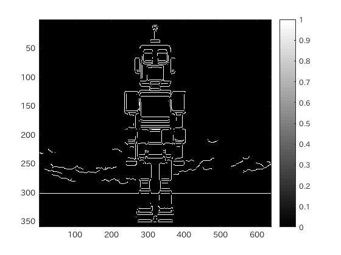

#課題10 レポート
####1.はじめに
ここでは、エッジ検出について確認する。

####2.エッジ検出
エッジ検出は、画像の輪郭を抽出する処理のことで、ここでは、Prewitt法、Sobel法、Canny法、Roberts法を用いたエッジ検出を観察する。

MATLABにおけるエッジ検出は、

```matlab
	IMG = edge(IMG, 'メソッド');
```

で処理できる。

今回は、メソッドとして、'Prewitt','Sobel','Canny','Roberts'を用いる。

####3.ソースコード
[ソースコード](/Program/Program10.m)

####4.実行結果
以下に実行結果を示す。  
<br>
図1.使用画像  
<br>
図2.Prewitt法  
<br>
図3.Sobel法  
<br>
図4.Canny法  
<br>
図5.Roberts法

####5.考察
以上のようにエッジ検出ができることが確認できた。

特に、prewitt法とsobel法では
ロボットの輪郭が正しく正確に抽出できていたが、Canny法では、強いエッジと連結している場合に弱いエッジが抽出されてしまうために、ロボットの下の床部分のエッジも抽出されていs待っていた。

Roberts方に関してもSobel法などと同様に、エッジが正しく抽出出来ていた。