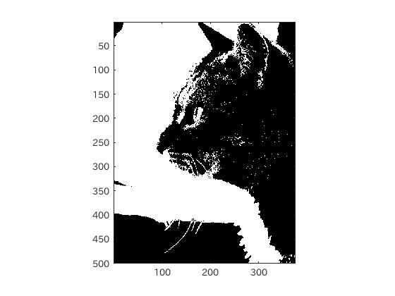

#課題2 レポート
####1. はじめに
ここでは階調数の違いによって生じる擬似輪郭について検討する。
<br><br>
####2.階調数の変更
まず画像を読み込む。今回はグレースケールに対して階調数を変更していく。  
そのためグレースケール画像を生成する。グレースケールにするためには、
rgb2gray関数を用いる。

    Gray = rgb2gray(IMG);
  
画像を2階調に変更するためには、濃度値を2分割してやればよく、0~127と128~255に分けることで2階調画像が出来上がる。4階調、8階調、16階調,32階調...も同様である。

MATLABにおいては、

```matlab
	IMG_2 = IMG > 256/2;
```
のようにすれば良い。これは、0~255の256値を2分割し、0~127を黒(0)128~255を白(1)のように変換し2階調画像にしている。

4階調では4分割、8階調では8分割というように、256値を階調数で分割し、それらを加算することでこれらが実現可能である。

####3.実行結果
<br>
図1.今回の使用画像<br>
<br>
図2.グレースケール変換後<br>
<br>
図3.2階調画像<br>
<br>
図4.4階調画像<br>
<br>
図5.8階調画像<br>

####4.ソースコード
[ソースコード](../Program/Program2.m)

####5.考察
実行結果の画像を見ると、階調数に応じて、色の数が変化していることがわかる。2階調の場合、白と黒の2色で、4階調になると更に、濃度の違う灰色が2色追加されていることがわかる。

このように、階調数によって色の表現が変わってくる。  
また、階調数が低いと、画像の濃淡の境目が輪郭のように見える擬似輪郭という現象が生じる。

階調数は、数値が大きければ大きいほど多様な濃度で画像の表現ができるために、自然な画像表現が可能である。しかし、階調数が大きいと1画素あたりのデータ量も増えるので、用途に応じた階調数を選択する必要がある。


