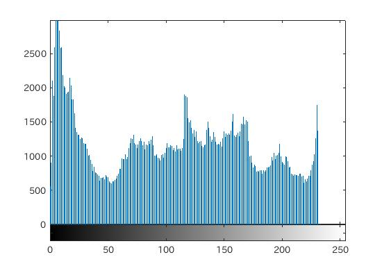

#課題4
####1.はじめに
ここでは、画像の濃度ヒストグラムをMATLABで表示して、確認する。

####2.ヒストグラム表示
画像の濃度ヒストグラムとは、画像の各画素値の濃度を採取し、その画像がどのような濃度構成になっているかをグラフにしたものである。

MATLABにおいて画像のヒストグラムを表示するためには、imhist()関数を用いる。

```matlab
	imhist() #-> 濃度ヒストグラムの生成
```

なお、MATLABにおいての濃度ヒストグラムの表示は、グレースケールの画像でないと表示できないために、画像をグレースケールに変換する必要がある。

####3.ソースコード
[ソースコード](../Program/program4.m)

####4.実行結果
  
図1.使用画像  
  
図2.図1の濃度ヒストグラム  
  
図3.使用画像2  
  
図4.図3の濃度ヒストグラム

####5.考察
濃度ヒストグラムは、対象画像の濃度構成がどのようになっているか調べることができる。  
実行結果からもわかるように、当たり前ではあるが画像によって濃度構成は変わる。そのためヒストグラムも異なっている。しかし、同じヒストグラムを持った画像があったとしてもその画像が同じであるとは限らない。

また、平坦化のようにこの濃度ヒストグラムに処理を加えることで、画像処理をすることもできる。

