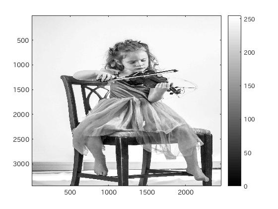
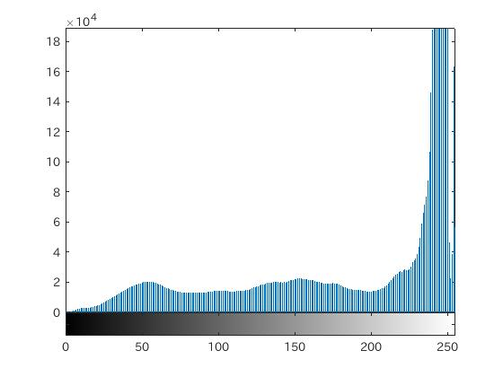
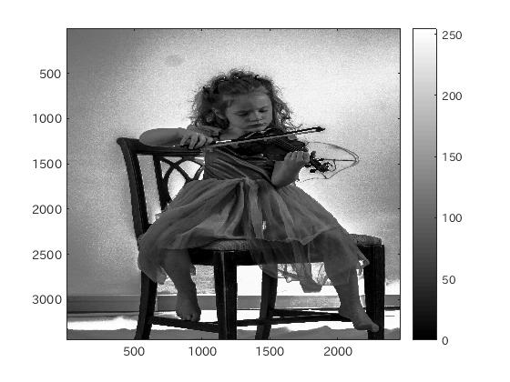

####1.はじめに
ここでは、濃度ヒストグラムの平坦化処理について検討する。

####2.平坦化処理
濃度変換処理の一つにヒストグラム平坦化処理という処理がある。

これは、画像の画素成分に偏りがある場合に、コントラストが低く表現されてしまう場合などの対処として用いられる。

具体的には、処理する階調数mと画像の全画素数Nを予め決めておき、濃度値の一番低い方から出現画素数を足してN/mになるまでを同一の濃度とみなす方法である。

MATLABには、平坦化処理関数としてhisteq関数が実装されている。

```matlab
	EQ = histeq(IMG,階調数);
```

今回は、階調数は指定しないものとする。

####3.ソースコード
[ソースコード](/Program/ProgramEX01.m)

####4.実行結果
以下に実行結果を示す。  
<br>
図1.使用画像  
<br>
図2.通常のグレースケール画像  
<br>
図3.通常時の濃度ヒストグラム  
<br>
図4.平坦化処理後の画像  
<br>
図5.平坦化処理後の濃度ヒストグラム

####5.考察
実行結果からも言えるように、平坦化処理をする前と後で明らかに画像に違いが出る。  
特に暗い成分の濃度値が強調されているために、全体的に暗い要素が増えた画像となっている。

ヒストグラムを見てもほとんど明るい成分の濃度値しかなかったものが暗い成分も平坦化によって強調されているために均一な濃度値分布となっていることがわかる。


