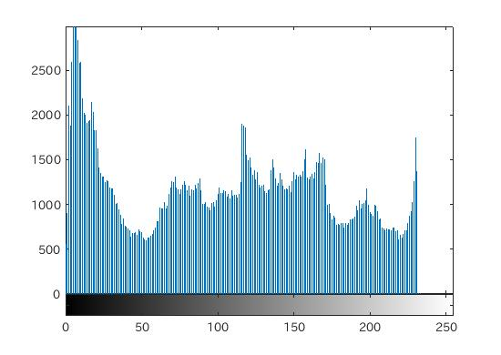

###4.ヒストグラム
ヒストグラム(濃度ヒストグラム)は、ディジタル画像の各画素における濃度値の出現頻度をグラフ化したものである。

  
図1.濃度ヒストグラム

図のように、横軸を濃度値、縦軸を出現頻度として表現する。

ヒストグラムの性質としては、

	1.対象画像がどのような濃度の画素構成となっているのかがわかる。
	2.画素の空間的な情報は失われてしまうために、同じ濃度ヒストグラムの画像であったとしても画像そのものが同じとは限らない。
	3.二つの画像を連結した画像の濃度ヒストグラム = 各画像の濃度ヒストグラムの和

####4-1.課題4 
[課題4　レポート](/Report/report04.md)